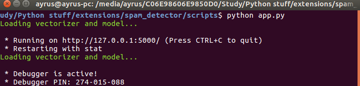
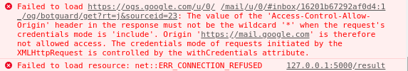

# SpamFilter-ChromeExtension
This is an applied application of machine learning. It is a chrome extension to detect spam messages. 

### Spam detection 
Naive Bayes classifiers are a popular statistical technique of e-mail filtering. They typically use ```bag of words``` features to identify spam e-mail, an approach commonly used in text classification.

Naive Bayes classifiers work by correlating the use of tokens (typically words, or sometimes other things), with spam and non-spam e-mails and then using Bayes' theorem to calculate a probability that an email is or is not spam. [More](https://en.wikipedia.org/wiki/Naive_Bayes_spam_filtering)

## Dependencies
For Python app: <br>
 * **skleran**
 * **flask**
 * **skleran**
 * **textblob**
 * **numpy**
 * **pandas**
 
 For Extension: <br>
 * **jquery**
 
  
## How to use
1. Download clone or download this repository.
2. Extract to some location
3. First, run **```app.py```** from **```script```** folder<br>
    Now flask server will start on localhost(http://127.0.0.1:5000/)<br><br>
    <br><br>
4. Now load extension in chrome.
  For this you need to load complete folder(SpamFilter-ChromeExtension) using ```Load unpacked extension``` in chrome extension manager  
5. Now you can check messages. 

## Note:
If you are not getting the result then check your browser console. If it is showing ```Access-Control-Allow-Origin``` error then, <br><br>
<br><br>
You can find a Chrome extension(https://chrome.google.com/webstore/detail/allow-control-allow-origi/nlfbmbojpeacfghkpbjhddihlkkiljbi) that will modify CORS headers on the fly in your application. Obviously, this is Chrome only, but I like that it works with zero changes anywhere at all.
You can use it for debugging your app on a local machine (if everything works in production).
### Notice: If URL becomes broken the extension name is Access-Control-Allow-Origin: *. I recommend you to disable this extension when you not working on your stuff, because, for example, youtube does not work with this extension.
<br><br>
<br><br>

### Please commit for any changes or bugs :)

